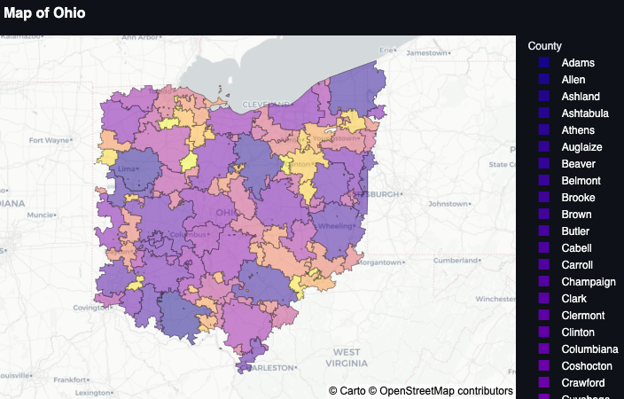
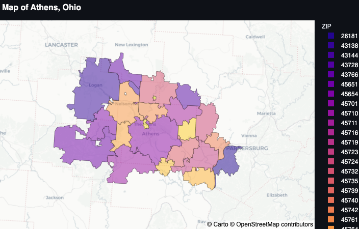

# streamlit-geomaps

A choropleth map divides a region into polygons, each outlining a region of
interest such as an administrative border or ZIP code.
This repository contains configuration and source files used to generate
an interactive choropleth map of the United States, with county-
and ZIP code-level resolution.
<!--
## Analysis

View the report [here](https://bainmatt.github.io/streamlit-geomaps/notebooks/report.html).
 -->

## Example

A state-level view of Ohio, USA, with choropleths representing its counties:

A county-level view of Athens, Ohio, with choropleths representing its ZIP
codes:

## Tools

This project uses the following tools:

- Data wrangling and preprocessing: [`Pandas`](https://pandas.pydata.org/docs/)
- Interactive plots: [`Plotly`](https://plotly.com/)
- Application build and deployment: [`Streamlit`](https://streamlit.io/)
